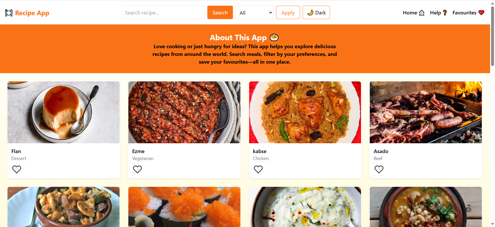
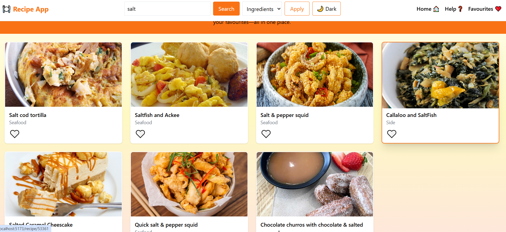
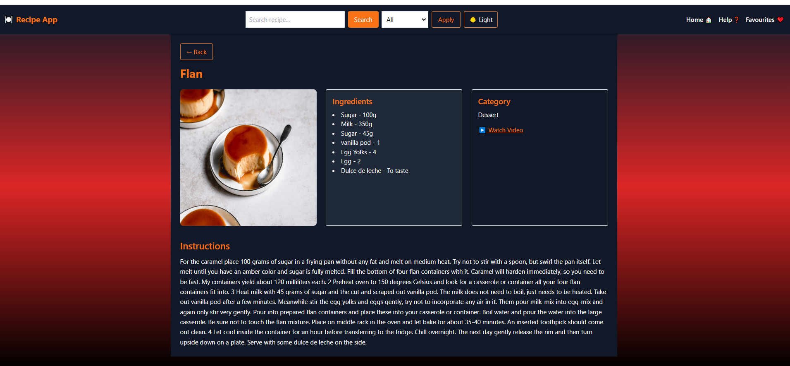
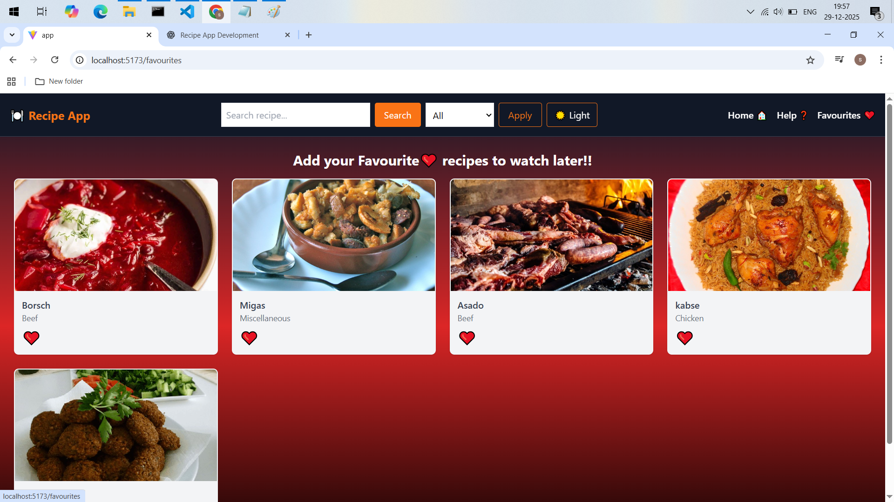
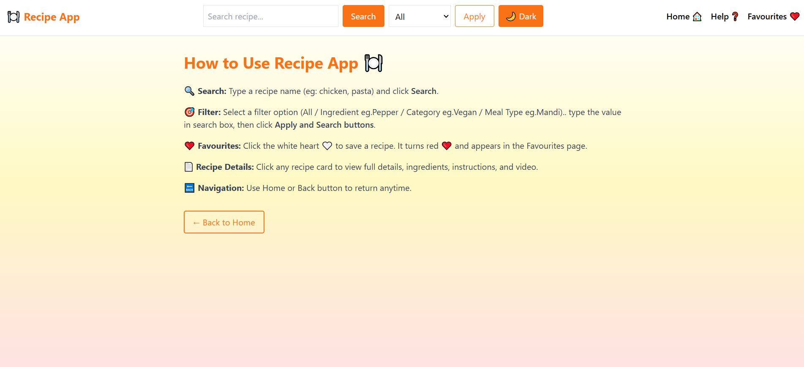

# Recipe App 

1. The Recipe App allows users to search and explore recipes using data fetched from a public API (TheMealDB).
2. Users can filter recipes based on ingredients, categories, or meal types to find relevant dishes easily.
3. The application provides a detailed recipe view, displaying ingredients, cooking instructions, category, and video links(for limited recipes).
4. Users can mark recipes as favourites, which are saved using LocalStorage for future access.
5. The app is built with a responsive and user-friendly interface, supporting dark/light mode and smooth navigation.

## Features

- **Search Recipes** by name 
- **Filter Recipes** by Ingredient(Eg.chicken), Category(Eg.vegan), or Meal Type(eg.mandi)
- **Add to Favourites** (stored using LocalStorage)
- **Recipe Details Page** with:
  - Ingredients
  - Instructions
  - Category
  - YouTube video (if available)
- **Dark / Light Mode**
- **Help Page** to guide users
- **Fully Responsive UI** (mobile, tablet, desktop)

## Tech Stack

- **React JS**
- **Tailwind CSS** (styling)
- **Axios** (API requests)
- **React Router DOM**
- **TheMealDB API**  
- https://www.themealdb.com/api.php-

## How to Use ?

1. Type a recipe name and click Search
2. Choose a filter and click Apply then Search
3. Click 🤍 to add recipes to Favourites
4. Click a recipe card to view full details
5. Use Help page for guidance
6. Toggle 🌙 / ☀️ for Dark or Light mode

# Screenshots of Recipe App

